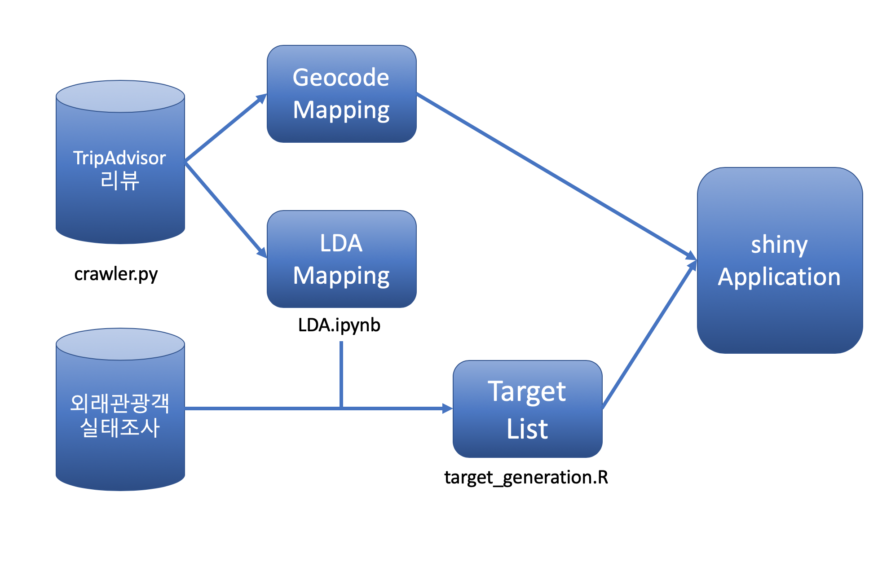
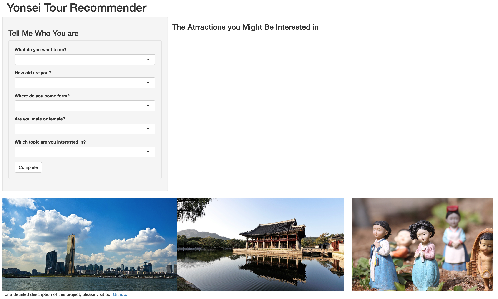
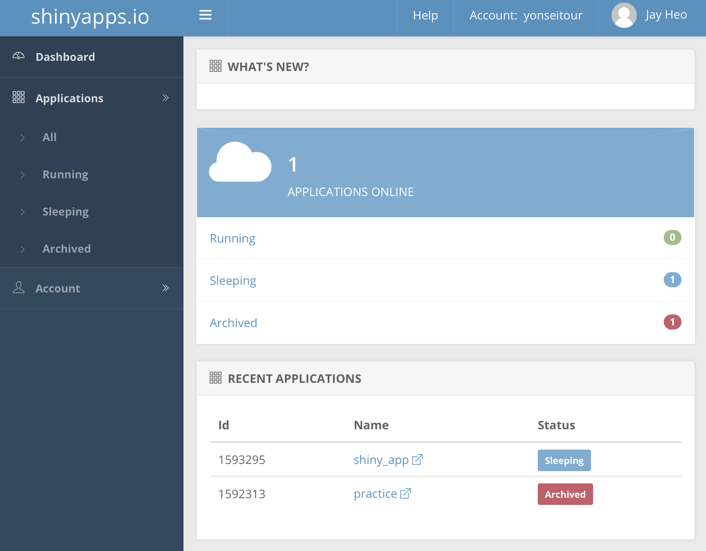

```{r setup, include=FALSE}
knitr::opts_chunk$set(echo = TRUE)
```

# S/W Architecture

## Data

해당 프로젝트에 사용되는 데이터는 다음과 같다.



### 2018 외래관광객 실태조사 원자료

한국관광공사가 우리나라를 방문한 외래관광객의 한국 여행실태, 한국내 소비실태 및 한국 여행 평가를 조사한 자료로 외래관광객의 한국 여행성향을 파악할 수 있다. 모델에서 주로 사용한 데이터는 집단 간의 차이가 뚜렷하게 나타나는 나이, 여행 목적, 국적. 그리고 여행자가 만족한 관광지 목록이다.

데이터는 해당 [링크](https://kto.visitkorea.or.kr/kor/notice/data/statis/tstatus/forstatus/board/view.kto?id=431236&isNotice=false&instanceId=295&rnum=5)가 포함된 한국관광공사 페이지에서 연도별로 갱신됨을 확인 할 수 있다.


### Tripadvisor reviews

Tripadvisor에서 크롤링한 리뷰 데이터가 담긴 데이터이다. TripAdvisor는 호텔 및 레스토랑 리뷰, 숙박 예약 및 기타 여행 관련 콘텐츠를 보여주는 미국 여행 웹사이트로 해외 유저들 개개인이 느끼고 경험한 바가 리뷰로 남겨져 있다.

크롤링하고자 하는 관광지의 url 목록을 가지고 있으면, `crawler.py`를 이용해 리뷰 내용을 긁어올 수 있다. 본 모델에서는 활용하지 않았지만 리뷰어들의 정보나 별점 등도 긁어오는 것이 가능하다. `url_cralwer.py`를 통해 url 목록만 수집하는 것도 가능하다.

외래관광객 실태조사의 <만족한 관광지>에 해당하는 관광지들을 추려, BeautifulSoup를 이용해 리뷰를 수집해 총 535개 관광지 / 약 60,000개 리뷰를 수집했고, 그 중 자료가 유의미한 161개 관광지에 해당하는 자료를 이후 분석에 사용하였다.


### LDA Mapping

각 관광지의 리뷰를 기반으로 LDA를 실시한 데이터이다.

자세한 설명은  `model/LDA.ipynb`를 참고하자.


### Geocode Mapping

관광지의 위치(위도, 경도)가 담긴 데이터이다. Google Map API를 사용한 Library인 `ggmap` 을 사용했다. 기본적인 코드는 다음과 같다.

```
library(ggmap)
register_google(key='Your API KEY')

mapping <- read.csv('Attractions.csv', stringsAsFactors = FALSE)
mapping <- mapping[!is.na(mapping$category),]
mapping <- mapping %>% mutate_geocode(attraction)
mapping[is.na(mapping$lon), 'attraction']
```

자세한 설명은   `model/geo_visualization.ipynb` 를 참고하자.


### Target Data

모델을 기반으로 모든 선택지의 예측 값을 저장해둔다. 기본적으로  `model/demographics_analysis.Rmd`의 내용에 기반하며, LDA Mapping 자료와 외래 관광객 실태조사를 전처리한 자료를 input으로 받는다.

자세한 설명은 `target_generation.R` 를 참고하자.


## Application - Shiny

### 개요

Shiny는 R에서 직접 인터렉티브 웹 앱을 쉽게 구축 할 수 있는 R 패키지이다. 모델을 간단하게 실행할 수 있게 하기 위한 어플리케이션이 필요하다고 느꼈기 때문에 Shiny를 활용하기로 했다.


### 구성

초기 화면은 다음과 같이 구성된다.



LDA에서 선정한 원하는 Topic과 방문 목적, 국적, 그리고 나이를 선택할 수 있다.

입력한 후의 화면은 다음과 같다.


1. 자신의 정보를 입력하면 앞서 소개한 모델에 입각해 3가지 관광지를 추천해준다.
2. 관광지가 속한 40 카테고리에 해당하는 이미지를 표시한다.
3. 관광지의 위치와 관광지의 Review가 담긴 Tripadvisor 페이지를 보여준다. (leaflet 사용)


## Publish - shinyapps.io

### 개요

shinyapps.io는 몇 분 안에 웹에서 shiny 응용 프로그램을 쉽게 공유 할 수있는 셀프 서비스 플랫폼이다.

서비스는 RStudio가 운영하는 공유 서버의 클라우드에서 실행됩니다. 각 응용 프로그램은 자체 포함되어 있으며 응용 프로그램과 함께 업로드 된 데이터 또는 데이터베이스 또는 웹 서비스와 같은 타사 데이터 저장소에서 코드를 가져 오는 데이터에서 작동한다.

많은 후보 중에서 가장 안정적으로 shiny를 운용할 수 있을 것으로 기대되어 위 사이트를 이용하기로 했다.


### 상세설명



대시보드에서 어플리케이션 별로 상태를 관리할 수 있다.

본 프로젝트의 결과로 나온 shiny Application은 [링크](https://yonseitour.shinyapps.io/shiny_app/)에서 확인할 수 있다.


