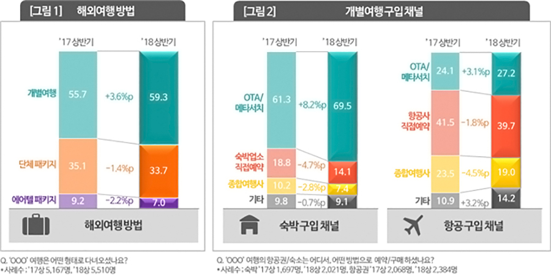
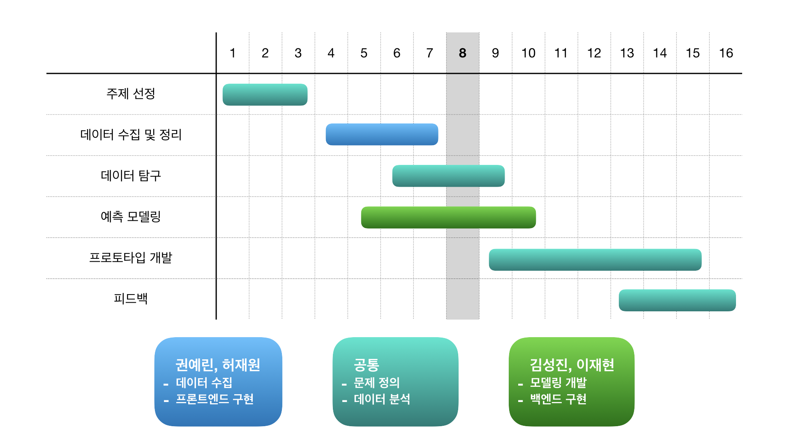
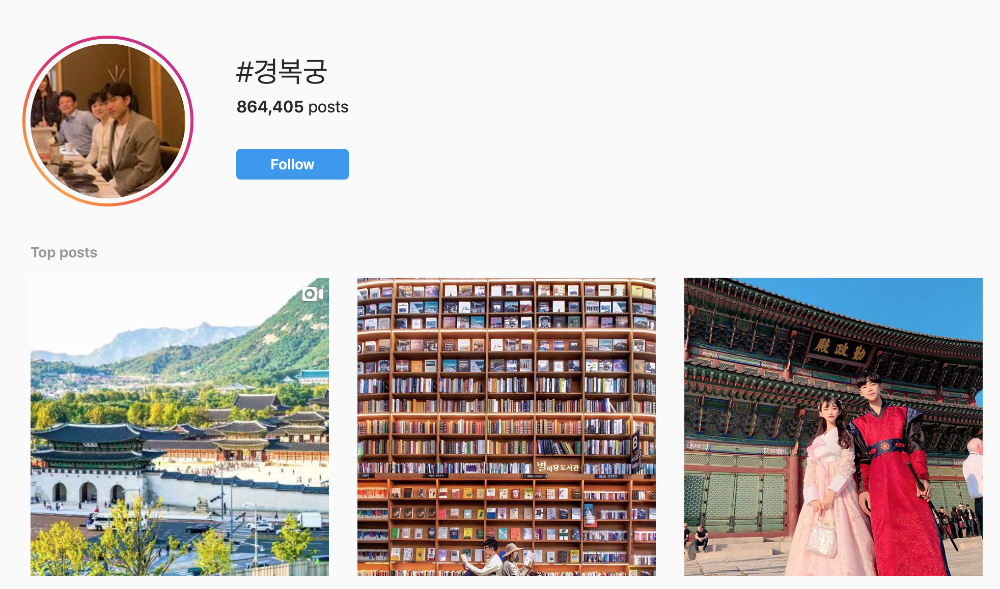

&nbsp;
&nbsp;
&nbsp;

```{r setup, include=FALSE}
knitr::opts_chunk$set(echo = TRUE)
```
# 개요

사용자의 MBTI 성향, 인구통계적 정보를 기반으로 한국 관광지를 추천해주는 시스템을 제안한다.

&nbsp;
&nbsp;
&nbsp;


# 주제 선정 이유

## 관광은 고부가가치 산업

[[관광산업①] 한국 관광은 ‘왜’ 이렇게 일본에 뒤처졌을까](https://www.sisajournal.com/news/articleView.html?idxno=177744)

- 인구 감소와 고령화는 소비와 생산, 유통을 동시에 위축시킴
- 관광은 상대적으로 젊은 유동인구를 유입시켜 소비와 유통을 늘리고 생산을 자극 -> 고용유발
- 지방 관광은 지역 사회 발전에도 영향  

&nbsp;
&nbsp;
&nbsp;

  
## 현 관광산업의 문제점

- 몰개성한 관광지 제안
  - 여행의 트렌드에 따른 코스
  - 여행사 일정에 따른 코스
  - 개인의 특성, 여행 목적과 무관한 코스
- 리뷰와 광고를 구분하기 어려움
- 여행 만족도 하락으로 이어짐  

&nbsp;
&nbsp;
&nbsp;

  
## 이제는 취향과 개성의 시대 - 맞춤형 관광지 추천




[[트렌드 인사이트]여행액티비티 시장 황금의 땅일까 1](http://www.ttlnews.com/article/travel_report/4166)

- 개별 여행의 증가 - 패키지 여행의 감소
- OTA/메타서치(익스피디아 등)를 통한 직접 예약이 증가하는 추세
- 획일화된 패키지 상품 시대에서 개인 맞춤형 상품의 시대로


&nbsp;
&nbsp;
&nbsp;


# 개발 일정 및 팀원 역할



&nbsp;
&nbsp;
&nbsp;


# 수집 데이터

## Tripadvisor 리뷰 데이터


- TripAdvisor는 호텔 및 레스토랑 리뷰, 숙박 예약 및 기타 여행 관련 콘텐츠를 보여주는 미국 여행 웹사이트
- 해외 유저들 개개인이 느끼고 경험한 바가 리뷰로 남겨져 있음
- BeautifulSoup를 이용해 서울의 관광지 리스트를 먼저 크롤링한 후, 그 리뷰들을 모음.
- 총 471개 관광지

```{r trip}
trip_Gyeongbokgung <- read.csv("./tripadvisor_crawler/review/Gyeongbokgung_Palace-Seoul.csv")
library(knitr)
kable(trip_Gyeongbokgung[1:5, ])
```


- 분석의 효율을 높이기 위해 전처리를 진행

```{}
def clean_review(text: str) -> str:
    # 1. unicode to ASCII
    text = unicodeToAscii(text)
            
    # 2. Remove HTML
    text = BeautifulSoup(text, "lxml").get_text()
    
    # 3. Remove Punctuations & lowercase
    text = "".join(v for v in text if v not in string.punctuation).lower().split()
    
    # 4. Remove Stop Word
    text = [word for word in text if word not in stop]
    
    # 5. lemmatization
    text = [lmtzr.lemmatize(word) for word in text]
    
    return ' '.join(text)
```

```{r pre_trip}
pre_Gyeongbokgung <- read.csv("./data/preprocess_gyeongbok.csv")
kable(pre_Gyeongbokgung[1:5, ])
```


&nbsp;
&nbsp;
&nbsp;


## Instagram 피드 데이터



- Instagram은 사진 및 비디오 공유 소셜 네트워킹 서비스

- 어떤 부분에서 관광객들이 매력을 느꼈는지 해시태그를 통해 확인할 수 있음

```{r insta}
insta_Gyeongbokgung <- read.csv("./instagram_crawler/sample_경복궁.csv")
kable(insta_Gyeongbokgung[1:5, ])
```
  
&nbsp;
&nbsp;
&nbsp;


## 외래관광객 실태조사

- 한국관광공사가 우리나라를 방문한 외래관광객의 한국 여행실태, 한국내 소비실태 및 한국 여행 평가를 조사한 자료 

- 외래관광객의 한국 여행성향을 파악할 수 있음 


[인포그래픽](https://kto.visitkorea.or.kr/file/download/bd/528174d7-6d8e-11e9-b01e-c515ccf49883.pdf.kto)


&nbsp;
&nbsp;
&nbsp;

# EDA

```{r, warning=FALSE, message=FALSE}
library(tidyverse)
```


## 국가별 방문자 수

```{r, echo=FALSE}
df_country <- read.csv('./data/출입국가별통계.csv', fileEncoding = 'euc-kr')
df_country$country <- as.character(df_country$country)
```
[한국관광공사 : 한국 관광 통계](https://kto.visitkorea.or.kr/kor/notice/data/statis/profit/board/view.kto?id=423699&isNotice=true&instanceId=294&rnum=0)

```{r, echo=FALSE}
df_country %>% 
    top_n(10, visitors) %>%
    arrange(-visitors) %>%
    ggplot(aes(reorder(country, -visitors), visitors, fill=continent)) +
    geom_bar(stat='identity') +
    scale_y_continuous("방문자 수",
                       breaks = c(1*10^6, 3*10^6, 5*10^6),
                       labels = c("1M", "3M", "5M")) +
    labs(title='2018 한국 국가별 방문자 수 TOP 10') + 
    theme_bw() + 
    theme(axis.text.x = element_text(angle = -45, vjust = 0.5, size=12),
          axis.title.x = element_blank(),
          plot.title = element_text(face = "bold", size = 15, hjust=0.5),
          legend.background = element_rect(fill = "white", size = 4, colour = "white"), 
          legend.justification = c(0, 1), 
          legend.position = c(0.75, 0.95),
          axis.ticks = element_line(colour = "grey70", size = 0.2),
          panel.grid.major = element_line(colour = "grey70", size = 0.2), 
          panel.grid.minor = element_blank())
```

[한국관광공사 :  외래 관광객 실태 조사](https://kto.visitkorea.or.kr/kor/notice/data/statis/tstatus/forstatus/board/view.kto?id=431236&isNotice=false&instanceId=295&rnum=4)

우리나라에 방문하는 외국인은 주로 아시아인이 많고 그 중에서도 중구과 일본이 압도적으로 많다.

```{r, echo=FALSE}
df_revisit <- read.csv('data/재방문비율.csv',  fileEncoding = 'euc-kr')
df_revisit$country <- as.character(df_revisit$country)
```

```{r, echo=FALSE}
df_country %>% 
    top_n(10, visitors) %>%
    arrange(-visitors) %>% 
    left_join(df_revisit, by='country') %>%
    mutate(REVISIT=visitors*revisit/100) %>%
    mutate(FIRST=visitors-REVISIT) %>%
    gather(is_first, num_of_visits, c('FIRST','REVISIT')) %>%
    select(country, is_first, num_of_visits, visitors, revisit) %>%
    ggplot(aes(reorder(country, -visitors), num_of_visits, fill=is_first)) +
    geom_bar(stat='identity') +
    geom_text(aes(y=-100000, label=round(revisit,1)), color='blue') + 
    scale_y_continuous("방문자 수",
                       breaks = c(1*10^6, 3*10^6, 5*10^6),
                       labels = c("1M", "3M", "5M")) +
    labs(title='2018 국가별 재방문 비율', fill='첫방문/재방문') +
    theme_bw() + 
    theme(axis.text.x = element_text(angle = -45, vjust = 0.5, size=12),
          axis.title.x = element_blank(),
          plot.title = element_text(face = "bold", size = 15, hjust=0.5),
          legend.background = element_rect(fill = "white", size = 4, colour = "white"), 
          legend.justification = c(0, 1), 
          legend.position = c(0.75, 0.95),
          axis.ticks = element_line(colour = "grey70", size = 0.2),
          panel.grid.major = element_line(colour = "grey70", size = 0.2), 
          panel.grid.minor = element_blank())
```

재방문 비율을 고객의 충성도라고 비유를 하자면 중국과 일본 홍콩은 우리나라 관광에 대한 충성도가 높은 편이고 그 외의 국가들은 현저하게 떨어진다.

```{r, echo=FALSE}
df_purpose <- read.csv('data/주요방한목적.csv',  fileEncoding = 'euc-kr')
df_purpose$country <- as.character(df_purpose$country)
```

```{r, echo=FALSE}
df_purpose %>% 
    filter(country=='중국'| country=='일본' | country=='홍콩' | country=='미국' | country=='러시아') %>%
    gather(purpose, proportion, colnames(df_purpose)[2:5]) %>%
    ggplot(aes(y=proportion, fill=factor(purpose))) +
    facet_wrap(~country) +
    geom_bar(aes(x=1), width=1, stat='identity')+ 
    # theme(legend.position = "none")+
    scale_x_discrete(NULL, expand = c(0, 0)) +
    scale_y_continuous(NULL, expand = c(0, 0)) +
    coord_polar(theta='y') +
    scale_fill_brewer(palette = "Set1") +
    labs(title='주요 방한 목적', fill='방문목적') + 
    theme_bw() + 
    theme(axis.title.x = element_blank(),
          axis.text = element_blank(),
          axis.ticks = element_blank(),
          plot.title = element_text(face = "bold", size = 15, hjust=0.5),
          legend.background = element_rect(fill = "white", size = 4, colour = "white"), 
          legend.justification = c(0, 1), 
          legend.position = c(0.75, 0.45),
          panel.grid  = element_blank())
```

미국의 경우 비즈니스 목적으로 한국에 방문하는 경우가 많다.

```{r, echo=FALSE}
df_purpose %>% 
    filter(country!='중국'& country!='일본' & country!='홍콩' & country!='미국' & country!='러시아') %>%
    gather(purpose, proportion, colnames(df_purpose)[2:5]) %>%
    ggplot(aes(y=proportion, fill=factor(purpose))) +
    facet_wrap(~country) +
    geom_bar(aes(x=1), width=1, stat='identity')+ 
    # theme(legend.position = "none")+
    scale_x_discrete(NULL, expand = c(0, 0)) +
    scale_y_continuous(NULL, expand = c(0, 0)) +
    coord_polar(theta='y') +
    scale_fill_brewer(palette = "Set1") +
    labs(title='주요 방한 목적', fill='방문목적') +
    theme_bw() + 
    theme(axis.title.x = element_blank(),
          axis.text = element_blank(),
          axis.ticks = element_blank(),
          plot.title = element_text(face = "bold", size = 15, hjust=0.5),
          legend.background = element_rect(fill = "white", size = 4, colour = "white"), 
          legend.justification = c(0, 1), 
          legend.position = c(0.75, 0.45),
          panel.grid  = element_blank())
```

하지만, 대부분의 국가들에서 여행을 목적으로 한국에 방문한다. 그러므로 한국에 온 방문자들을 여행자(고객)으로 취급하도록 하겠다.

## 한국 방문을 선택하게 된 요인들

```{r, echo=FALSE}
df_factor <- read.csv('data/방문고려요인.csv',  fileEncoding = 'euc-kr')
df_factor$country <- as.character(df_factor$country)
```

```{r, echo=FALSE}
# 중복투표 해결
N = ncol(df_factor)
df_factor = df_factor %>% 
    select(-country) %>%
    mutate(rowsum=rowSums(.)) %>%
    mutate_at(1:N, ~./rowsum) %>%
    select(-rowsum) %>%
    mutate(country=df_factor$country)
```

```{r, echo=FALSE}
df_factor %>% 
    filter(country=='중국'| country=='일본' | country=='홍콩' | country=='미국' | country=='러시아') %>%
    gather(Tfactor, proportion, colnames(df_factor)[-N]) %>%
    ggplot(aes(y=proportion, fill=factor(Tfactor))) +
    facet_wrap(~country) +
    geom_bar(aes(x=1), width=1, stat='identity')+ 
    scale_fill_brewer(palette = "Set1") +
    # theme(legend.position = "none")+
    scale_x_discrete(NULL, expand = c(0, 0)) +
    scale_y_continuous(NULL, expand = c(0, 0)) +
    coord_polar(theta='y') +
    labs(title='한국 방문 선택 시 고려요인', fill='요인') +
    theme_bw() + 
    theme(axis.title.x = element_blank(),
          axis.text = element_blank(),
          axis.ticks = element_blank(),
          plot.title = element_text(face = "bold", size = 15, hjust=0.5),
          legend.background = element_rect(fill = "white", size = 4, colour = "white"), 
          #legend.justification = c(0, 1), 
          #legend.position = c(0.75, 0.55),
          panel.grid  = element_blank())
  
```

**초록색(역사.유적지)**을 집중해서 보면 미국, 러시아는 이색적인 역사 유적을 남다르게 좋아한다.

**빨강색(쇼핑)**을 집중해서 보면 일본, 홍콩, 중국은 쇼핑을 하러 오는 경우가 많다.

```{r, echo=FALSE}
df_factor %>% 
    filter(country!='중국'& country!='일본' & country!='홍콩' & country!='미국' & country!='러시아') %>%
    gather(Tfactor, proportion, colnames(df_factor)[-N]) %>%
    ggplot(aes(y=proportion, fill=factor(Tfactor))) +
    facet_wrap(~country) +
    geom_bar(aes(x=1), width=1, stat='identity')+ 
    scale_fill_brewer(palette = "Set1") +
    # theme(legend.position = "none")+
    scale_x_discrete(NULL, expand = c(0, 0)) +
    scale_y_continuous(NULL, expand = c(0, 0)) +
    coord_polar(theta='y') +
    labs(title='한국 방문 선택 시 고려요인', fill='요인') +
    theme_bw() + 
    theme(axis.title.x = element_blank(),
          axis.text = element_blank(),
          axis.ticks = element_blank(),
          plot.title = element_text(face = "bold", size = 15, hjust=0.5),
          legend.background = element_rect(fill = "white", size = 4, colour = "white"), 
          #legend.justification = c(0, 1), 
          #legend.position = c(0.75, 0.55),
          panel.grid  = element_blank())
```

**노란색(케이팝)**과 **보라색(자연풍경)**을 이전의 그림과 비교해서 보면 자연 풍경과 케이팝에 관심이 많다.

```{r, echo=FALSE}
df_factor_demo <- read.csv('data/방문고려요인_인구통계.csv',  fileEncoding = 'euc-kr')
df_factor_demo$demographic <- as.character(df_factor_demo$demographic)
```

```{r, echo=FALSE}
# 중복투표 해결
N_demo = ncol(df_factor_demo)
df_factor_demo = df_factor_demo %>% 
    select(-demographic) %>%
    mutate(rowsum=rowSums(.)) %>%
    mutate_at(1:N, ~./rowsum) %>%
    select(-rowsum) %>%
    mutate(demographic=df_factor_demo$demographic)
```

```{r, echo=FALSE}
df_factor_demo %>% 
    filter(demographic=='남성'| demographic=='여성') %>%
    gather(Tfactor, proportion, colnames(df_factor_demo)[-N_demo]) %>%
    ggplot(aes(x=Tfactor, y=proportion, fill=demographic)) +
    geom_bar(stat='identity', position='dodge') +
    scale_fill_manual(values = c("#2E9FDF", "#FC4E07")) +
    labs(title='한국 방문 선택 시 고려요인 (인구통계)', fill='요인') + 
    theme_bw() + 
    theme(axis.text.x = element_text(angle = -45, vjust = 0.5, size=10),
          axis.title.x = element_blank(),
          plot.title = element_text(face = "bold", size = 15, hjust=0.5),
          legend.background = element_rect(fill = "white", size = 4, colour = "white"), 
          legend.justification = c(0, 1), 
          legend.position = c(0.75, 0.95),
          axis.ticks = element_line(colour = "grey70", size = 0.2),
          panel.grid.major = element_line(colour = "grey70", size = 0.2), 
          panel.grid.minor = element_blank())  
```

한국에 방문하게 된 고려 요인에서 남성고객과 여성고객의 비율적으로 큰 차이가 나는 것은 유흥과 케이팝같다.

남성고객의 경우 한국의 술문화나 밤거리에 좀 더 관심이 있고 여성고객의 경우 케이팝에 관심이 있다.

이런 디테일을 명소 추천에 반영하게 되면 좋을 것 같다.


```{r, echo=FALSE}
df_factor_demo %>% 
    filter(demographic!='남성'& demographic!='여성') %>%
    gather(Tfactor, proportion, colnames(df_factor_demo)[-N_demo]) %>%
    ggplot(aes(x=Tfactor, y=proportion, fill=demographic)) +
    geom_bar(stat='identity', position='dodge') +
    labs(title='한국 방문 선택 시 고려요인 (인구통계)', fill='요인') + 
    theme_bw() + 
    theme(axis.text.x = element_text(angle = -45, vjust = 0.5, size=10),
          axis.title.x = element_blank(),
          plot.title = element_text(face = "bold", size = 15, hjust=0.5),
          legend.background = element_rect(fill = "white", size = 4, colour = "white"), 
          legend.justification = c(0, 1), 
          legend.position = c(0.75, 0.95),
          axis.ticks = element_line(colour = "grey70", size = 0.2),
          panel.grid.major = element_line(colour = "grey70", size = 0.2), 
          panel.grid.minor = element_blank())  
```

젊은 고객들은 역사 유적지는 고려하지 않고 케이팝, 패션 트렌드를 고려하고 한국에 방문하는 경향이 있다.


## 한국 여행에서 가장 필요한 정보 

```{r, echo=FALSE}
df_info <- read.csv('data/여행중필요정보.csv',  fileEncoding = 'euc-kr')
```

```{r, echo=FALSE}
#중복투표 해결
M = ncol(df_info)
df_info = df_info %>% 
    mutate(rowsum=rowSums(.)) %>%
    mutate_at(1:N, ~./rowsum) %>%
    select(-rowsum)
```

```{r, echo=FALSE}
df_info %>% 
    gather(info, proportion, colnames(df_info)) %>%
    ggplot(aes(y=proportion, fill=factor(info))) +
    geom_bar(aes(x=1), width=1, stat='identity')+ 
    scale_fill_brewer(palette = "Set1") +
    # theme(legend.position = "none")+
    scale_x_discrete(NULL, expand = c(0, 0)) +
    scale_y_continuous(NULL, expand = c(0, 0)) +
    coord_polar(theta='y') +
    labs(title='한국 여행 준비 중 가장 필요했던 정보', fill='필요 정보') +
    theme_bw() + 
    theme(axis.title.x = element_blank(),
          axis.text = element_blank(),
          axis.ticks = element_blank(),
          plot.title = element_text(face = "bold", size = 15, hjust=0.5),
          legend.background = element_rect(fill = "white", size = 4, colour = "white"), 
          #legend.justification = c(0, 1), 
          #legend.position = c(0.75, 0.55),
          panel.grid  = element_blank())
```

우리가 **관광지를 추천**하고자 하는 것이 실제로 외국인 관광객들이 교통편 다음으로 **가장 필요로 하는 정보**이다.

관광객들이 정보로 필요로하는 맛집정보나 쇼핑장소도 관광지라는 범주에 포함시킨다면 가치있는 아이템이 될 수 있다고 본다.

## 한국 방문 후에 만족했던 활동들

```{r, echo=FALSE}
df_satisfied <- read.csv('data/가장만족한활동.csv',  fileEncoding = 'euc-kr')
```

```{r, echo=FALSE}
# 중복투표 해결
NN = ncol(df_satisfied)
df_satisfied = df_satisfied %>% 
    select(-country) %>%
    mutate(rowsum=rowSums(.)) %>%
    mutate_at(1:NN, ~./rowsum) %>%
    select(-rowsum) %>%
    mutate(country=df_satisfied$country)
```

```{r, echo=FALSE}
df_satisfied %>% 
    filter(country=='중국'| country=='일본' | country=='홍콩' | country=='미국' | country=='러시아') %>%
    gather(satisfied, proportion, colnames(df_satisfied)[-NN]) %>%
    ggplot(aes(y=proportion, fill=factor(satisfied))) +
    facet_wrap(~country) +
    geom_bar(aes(x=1), width=1, stat='identity')+ 
    scale_fill_brewer(palette = "Set1") +
    # theme(legend.position = "none")+
    scale_x_discrete(NULL, expand = c(0, 0)) +
    scale_y_continuous(NULL, expand = c(0, 0)) +
    coord_polar(theta='y') +
    labs(title='가장 만족한 활동', fill='활동') +
    theme_bw() + 
    theme(axis.title.x = element_blank(),
          axis.text = element_blank(),
          axis.ticks = element_blank(),
          plot.title = element_text(face = "bold", size = 15, hjust=0.5),
          legend.background = element_rect(fill = "white", size = 4, colour = "white"), 
          #legend.justification = c(0, 1), 
          #legend.position = c(0.75, 0.55),
          panel.grid  = element_blank())
```

미국, 러시아인의 음식 기호는 맞추지 못하는 것 같다. 그리고 그들은 이색적인 역사 유적과 박물관을 남 다르게 좋아한다.

전통문화체험을 만족한 경우는 방문객 수 대비 드문 것 같다.

```{r, echo=FALSE}
df_satisfied %>% 
    filter(country!='중국'& country!='일본' & country!='홍콩' & country!='미국' & country!='러시아') %>%
    gather(satisfied, proportion, colnames(df_satisfied)[-NN]) %>%
    ggplot(aes(y=proportion, fill=factor(satisfied))) +
    facet_wrap(~country) +
    geom_bar(aes(x=1), width=1, stat='identity')+ 
    scale_fill_brewer(palette = "Set1") +
    # theme(legend.position = "none")+
    scale_x_discrete(NULL, expand = c(0, 0)) +
    scale_y_continuous(NULL, expand = c(0, 0)) +
    coord_polar(theta='y') +
    labs(title='가장 만족한 활동', fill='활동') +
    theme_bw() + 
    theme(axis.title.x = element_blank(),
          axis.text = element_blank(),
          axis.ticks = element_blank(),
          plot.title = element_text(face = "bold", size = 15, hjust=0.5),
          legend.background = element_rect(fill = "white", size = 4, colour = "white"), 
          #legend.justification = c(0, 1), 
          #legend.position = c(0.75, 0.55),
          panel.grid  = element_blank())
```

전통문화체험에 대해서 만족도가 이전 국가들에 비해서 높은 것이 눈에 띈다.

그 외에도 자연경관에 대해서 만족도도 높고 놀이공원에 대한 만족도도 높다.

```{r, echo=FALSE}
df_satisfied_demo <- read.csv('data/가장만족한활동_인구통계.csv',  fileEncoding = 'euc-kr')
```

```{r, echo=FALSE}
# 중복투표 해결
NNN = ncol(df_satisfied_demo)
df_satisfied_demo = df_satisfied_demo %>% 
    select(-demographic) %>%
    mutate(rowsum=rowSums(.)) %>%
    mutate_at(1:NNN, ~./rowsum) %>%
    select(-rowsum) %>%
    mutate(demographic=df_satisfied_demo$demographic)
```

```{r, echo=FALSE}
df_satisfied_demo %>% 
    filter(demographic=='남성'| demographic=='여성') %>%
    gather(satisfied, proportion, colnames(df_satisfied_demo)[-NNN]) %>%
    ggplot(aes(x=satisfied, y=proportion, fill=demographic)) +
    geom_bar(stat='identity', position='dodge') +
    scale_fill_manual(values = c("#2E9FDF", "#FC4E07")) +
    labs(title='가장 만족한 활동 (인구통계)', fill='활동') + 
    theme_bw() + 
    theme(axis.text.x = element_text(angle = -45, vjust = 0.5, size=10),
          axis.title.x = element_blank(),
          plot.title = element_text(face = "bold", size = 15, hjust=0.5),
          legend.background = element_rect(fill = "white", size = 4, colour = "white"), 
          legend.justification = c(0, 1), 
          legend.position = c(0.75, 0.95),
          axis.ticks = element_line(colour = "grey70", size = 0.2),
          panel.grid.major = element_line(colour = "grey70", size = 0.2), 
          panel.grid.minor = element_blank())
```

여성 고객들이 쇼핑에 좀 더 관심을 보이는 경향이 있다.

```{r, echo=FALSE}
df_satisfied_demo %>% 
    filter(demographic!='남성'& demographic!='여성') %>%
    gather(satisfied, proportion, colnames(df_satisfied_demo)[-NNN]) %>%
    ggplot(aes(x=satisfied, y=proportion, fill=demographic)) +
    geom_bar(stat='identity', position='dodge') +
    labs(title='가장 만족한 활동 (인구통계)', fill='활동') + 
    theme_bw() + 
    theme(axis.text.x = element_text(angle = -45, vjust = 0.5, size=10),
          axis.title.x = element_blank(),
          plot.title = element_text(face = "bold", size = 15, hjust=0.5),
          legend.background = element_rect(fill = "white", size = 4, colour = "white"), 
          legend.justification = c(0, 1), 
          legend.position = c(0.85, 0.95),
          axis.ticks = element_line(colour = "grey70", size = 0.2),
          panel.grid.major = element_line(colour = "grey70", size = 0.2), 
          panel.grid.minor = element_blank())
```

비율로 봤을 때, 놀이공원이나 민속 행사 관련된 부분은 10대가 60대에 비해 2~3배 더 관심이 있다.

자연경관쪽에서도 10대 고객은 60대에 비해 현저하게 낮은 관심을 보이고 있다.


# 모델링

## 프로토타입 구조


**개요**

> 관광지 리뷰와 사용자들의 개인 별 설문 조사에 기반하여 관광지를 추천한다.
>
> 1. 관광지 **리뷰, 여행지 정보 문서**에 대해서 단어 빈도수에 기반하여 **LDA 토픽 모델링**을 진행한다.
>
> 2. 가입하기 전 **설문 조사**를 대해서 **MBTI 성격유형 조사**와 **여행 전문 설문조사**를 진행한다.
>
> 3. 성격과 인구통계 정보가 기록된 유저들의 관광지 리뷰 및 평점이 쌓이게 된 후에 데이터에 근거한 여행지 추천을 해준다. 
> 
> > 성격이 기록된 유저 별 여행지 선호 데이터가 없는 현 상황에서는, 성격 정보 중에서도 외향적인 성격만 반영하여 심리학 논문에 기반한 여행지를 추천해주는 것이다.

## LDA

1. 각 여행지는 $K$개의 토픽 mixture로 이루어져 있고 토픽 별로 word 등장 확률이 정해져 있다.
2. 리뷰 내의 단어들은 $K$개의 토픽 중 한 토픽에 의해서 generated됐다고 가정한다.  

LDA가 제안하기를...

> **문서 별 주제에 대한 사전 분포**는 multinomial distribution의 conjugate prior **Dirichlet distribution**
>
> **주제 별 단어 사전 분포**도 multinomial distribution의 conjugate prior인 **Dirichlet distribution**을 사용


이를 통해 얻어진 Dirichlet 사후 분포를 통해서 여행지를 토픽 심플렉스 $S^K$ 상의 원소로 볼 수 있는 이유는 

> Dirichlet 분포의 특징을 이용해 **문서 별 토픽에 대한 비율로** 표현할 수 있기 때문이다.
> $$
> \operatorname{E}[Dir(\alpha_1, \cdots, \alpha_K)] = (\frac{\alpha_1}{\sum \alpha_k }, \cdots , \frac{\alpha_K}{\sum \alpha_k })
> $$

마찬가지로, 주제 별 단어의 사후 분포 역시 위를 통해서 단어 심플렉스 $S^V$ 상의 원소로 볼 수 있게 된다.


## 협업 필터링

- 사용자들로부터 얻은 상품에 대한 선호도를 이용하여 관심사를 예측하는 기법

- 아마존, 넷플릭스 등에서 사용되고 있음

  


## MBTI 성격유형 검사

> 차별화된 서비스

(1) **추천 알고리즘** : 고객 맞춤형 추천 서비스
(2) **관광 테마** : 외국인 관광객들 위한 서비스로 확장한다. 제한된 시간 안에 관광 만족도를 최대로 높일 수 있는 '관광 테마'를 추천한다. 

- **향후 서비스 발전** : MBTI 검사 결과를 토대로 고객의 성격 유형과 가장 잘 맞는 관광지 테마/코스를 추천한다. 
신규 가입자 대상 MBTI 성격 유형을 검사하고, 고객이 선호하는 관광지 데이터를 학습해 

- **핵심** : 성격 유형에 근거한 관광지 선호 예측 -> 추천 시스템 구현
* Mishcel, Shoda & Smith는 2003년 논문에서 성격이 "과거 기억에 근거해 현재와 미래를 해석할 수 있는 연결고리"라 봤다. 성격이 과거 경험에 따라 결정되는데, 이에 그 사람의 경험과 성격을 분석하면 현재와 미래에 대한 개연성 있는 예측을 할 수 있다고 봤다. 

> MBTI란?

- 융(1976) 심리유형이론에 근거. 
- 외향성/직관성/감정성/인식성 이 네 개 척도를 가지고 사람의 성격을 모두 16개 유형으로 분류한다. 
(1) **외향성** : 활발한가?
(2) **직관성** : 정보를 언어와 직관 중 무엇으로 소화하나?
(3) **감정성** : 논리에 근거하나 감정에 따라 행동하나?
(4) **인식성** : 규칙을 새로 정하길 좋아하나 주어진 규칙에 순응하길 좋아하나?

- 검사 결과는 진로 및 심리 상담 등 여러 방면에 활용된다. 

> 검사 문항 구성

- 류시영, 김태희(2011)는 *외향성 지표*가 관광지 선호와 가장 밀접한 관계가 있다고 봤다. 검사의 초점은 외향성을 측정하는 데 있다.
- 검사 문항은 *20개*로 제한한다. 

> 문항 유형

- 외향성
- 직관성/감정성/인식성
- 기타
- 인구통계자료 : 나이, 혼인 여부 등

> 1. 외향성 지표
- 나는 새로운 사람 만나기를 좋아한다
- 나는 사람 돕는 것을 좋아한다
- 빠르게 대응하기보다 충분히 생각한 후 답하기를 좋아한다
- 다양한 부류의 친구들이 있다
- 쉽게 긴장을 푼다
- 나는 어울리기에 편한 사람이다. 

> 2. 직관성
- 이미 검증된 기술보다 새로운 기술 익히기를 좋아한다.
- 구체적인 것보다 비유적인 게 좋다.
- 미래보단 현재가 중요하다.
- 관광지의 설명을 듣는 것보다 사진 보는 게 더 중요하다.

> 3. 감정성/인식성
- 나는 일을 조직하기를 즐긴다.
- 단점을 보고 비판적인 경향이 있다.
- 일을 시작하는 데서 만족을 얻는다.
- 나는 쉽게 실망한다.
- 새로운 정보를 접하면 그때마다 목표를 수정한다.
- 현재를 즐기고 일은 나중에 마무리한다.

> 4. 기타 질문
- 소셜 미디어를 자주 사용한다.
- 친구보다 가족과 더 많은 시간을 보낸다.
- 가격이 비싸도 만족도가 높으면 상관없다. 

### 사용자 기반 필터링

- 선호 이력이 유사한 다른 사용자의 선호 아이템을 탐색
- 아직 구매하지 않은 아이템을 추천
- 사용자 3과 가장 유사한 사용자 1의 선호 아이템을 추천
&nbsp;
&nbsp;
&nbsp;


### 아이템 기반 필터링

- 사용자 선호 아이템을 탐색
- 해당 아이템과 유사한 아이템을 추천 (사과와 햄버거)
- 햄버거를 구매한 사용자에게 사과를 추천  
&nbsp;
&nbsp;
&nbsp;
  
### 한계

- 실제 사용자의 데이터가 있어야 한다는 점이 단점
- 단순 아이템 기반 모델링의 한계를 보완하고자 도입, 차순위에 두고 진행할 예정

